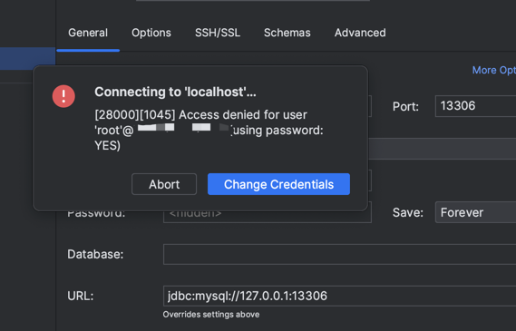

# http2tcp

## What is that?
sometime our service only provide http that can not provide separate tcp service,we can use `http2tcp` to solve it.  


## How to use?
### use in your project (base net/http)
```shell
go get github.com/MikeLINGxZ/http2tcp
```
```go
package main

import (
	"github.com/MikeLINGxZ/http2tcp"
	"net/http"
)

func main() {
    http.HandleFunc("/path",http2tcp.ProxyForHttpHandler)
	http.ListenAndServe(":8080", nil)
}
```
edit client config
```yaml
WebsocketServer: ws://127.0.0.1:7889/proxy
Auth: 123456
Targets:
  - LocalHost: 127.0.0.1
    LocalPort: 13306
    RemoteHost: 17.21.23.115
    RemotePort: 3306
```
run client on your pc
```go
./http2tcp_client
```

### standalone use
edit server config
```yaml
Host: 0.0.0.0
Port: 7889
Path: /proxy
Auth: 123456
```
run server
```shell
./http2tcp_server
```
edit client config
```yaml
WebsocketServer: ws://127.0.0.1:7889/proxy
Auth: 123456
Targets:
  - LocalHost: 127.0.0.1
    LocalPort: 13306
    RemoteHost: 17.21.23.115
    RemotePort: 3306
  - LocalHost: 127.0.0.1
    LocalPort: 18500
    RemoteHost: 17.21.23.115
    RemotePort: 8500
```
run client on your pc
```go
./http2tcp_client
```

## Effect
### proxy tcp
 
### proxy http

